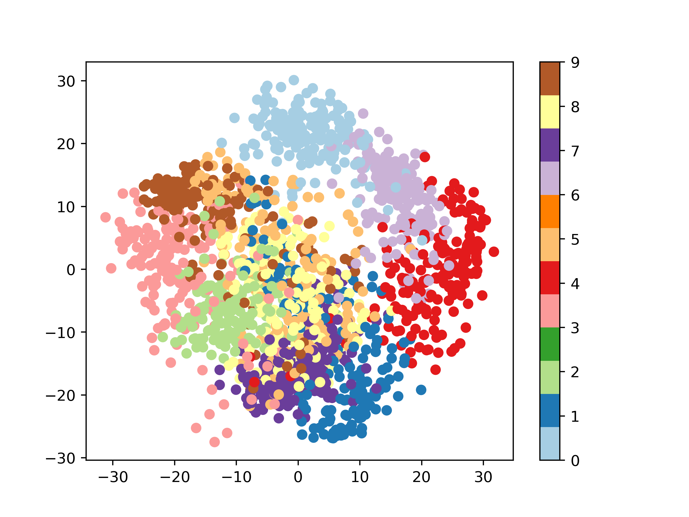

### Multiclass Logistic regression
Accuracy:  26.666666666666668

### K=4 fold cross validation for digits dataset
Accuracy:  79.33333333333333 \
Accuracy:  71.49220489977728 \
Accuracy:  72.16035634743875 \
Accuracy:  78.61915367483296

Average accuracy: 75.40126206384558

### Scatter plot of digits dataset

